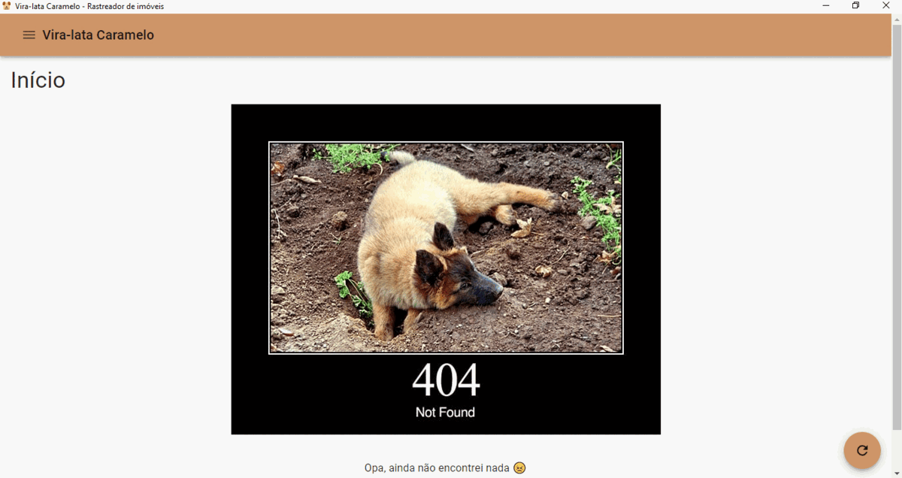

# Vira-lata Caramelo 🐕

⚠ To read this in portuguese, please click [here](./README.md).

Vira-lata Caramelo (Caramel Stray Dog in a loose translation) is an app thar periodically verifies brazilian
real estate websites for real estates available for leasing based on some parameters like:

1. Total cost (rent plus taxes)
2. Bedrooms quantity
3. City area

The motto to build this app was to ease the search for new real estate for people whiling to relocate. The search
process could be exhaustive, specially when you are looking in many different websites and work all day, it could
be hard to keep tracking of the availability of new real estates quickly.

Another reason to build this was the amount of time spent by
[Homes](https://help.quintoandar.com.br/hc/pt-br/articles/360023947132-O-que-%C3%A9-o-Homes-) (a tool offer by one of
Real Estate dealer in brazil to send periodic new real estates based on some filters) to send new posts. The name
**Caramel Stray Dog** it is a tribute to Homes (which is a blue dog) and to the brazilian mascot,
the caramel stray dog, which is a very common mixed breed easily found in brazilian streets.

This app is built with tools like [Electron](https://www.electronjs.org/),
[React](https://reactjs.org/) and [TypeScript](https://www.typescriptlang.org/).

At this moment you can only search for real estates available for **leasing** using only
[Quinto Andar](https://www.quintoandar.com.br/) as search provider.

⚠ The [Quinto Andar](https://www.quintoandar.com.br/) *does not sponsor* this project ~~unfortunately~~.

# Build 🛠

To build a executable version ready to distribution of this app, run `yarn package` or `yarn make`.

The first one creates a executable version based on the current OS and the second do the same with a plus which
is to create a installable bundle also based on the current OS.

# Run 🏃‍♂️

To run this app locally just execute the command `yarn start` after install all packages via `yarn` command.
Remember to run this commands in project root directory.

# TODO 📝

* Unit tests within the CI
* More search filters (_e.g._ number of bathrooms, number of garages, etc.)
* Customizable search periodicity
* CD pipeline
* More real estate dealers (_e.g._ Casa Mineira, Zap Imóveis, OLX, etc.)
* Search for real estates available for sale
* Favorites list
* Visual feedback for post already seen
* Ignored list
