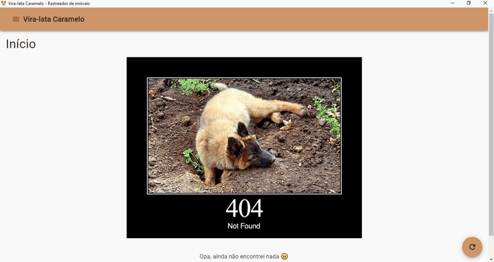

# Vira-lata Caramelo 🐕

⚠ To read this in english, please click [here](./README.en.md).

Vira-lata Caramelo é uma aplicação desktop que verifica periodicamente sites
de aluguel de imóveis de acordo com 3 parâmetros de busca, sendo eles:

1. Custo máximo do aluguel (aluguel + IPTU + seguro incêndio + outros custos)
2. Quantidade de quartos
3. Área da cidade

A motivação para a criação dessa solução foi facilitar a minha vida em momentos que quero mudar de cidade/imóvel,
já que a pesquisa pode ser muito cansativa, logo, ter uma aplicação que faça o trabalho de buscar e responder rápido
a novos imóveis anunciados é de grande ajuda, principalmente para quem não tem muito tempo durante o dia para ficar
pesquisando.

Outro motivo foi a demora que é para o
[Homes](https://help.quintoandar.com.br/hc/pt-br/articles/360023947132-O-que-%C3%A9-o-Homes-) trazer novos
anúncios e, em homenagem ao mascote nacional e como uma referência ao Homes, veio o nome de Vira-lata Caramelo.

Essa aplicação foi construída usando tecnologias/ferramentas como [Electron](https://www.electronjs.org/),
[React](https://reactjs.org/) e [TypeScript](https://www.typescriptlang.org/).

Nesse momento a busca é feita somente para **aluguel** de imóveis e usando o
[Quinto Andar](https://www.quintoandar.com.br/) como provedor da busca.

⚠ O [Quinto Andar](https://www.quintoandar.com.br/) não patrocina esse projeto ~~infelizmente~~

# Build 🛠

Para construir uma distribuição da aplicação, basta executar o comando `yarn package` ou o comando `yarn make`.

O primeiro gera uma versão executável da aplicação pronta para produção e o segundo faz a mesma coisa, porém já
empacotando-a, facilitando a distribuição.

# Run 🏃‍♂️

Para rodar a aplicação localmente pasta executar o comando `yarn start` depois de instalar os pacotes através do
comando `yarn`, ambos os comandos sendo executados na raiz do projeto.

# TODO 📝

* Testes automatizados integrados ao CI
* Customização da periodicidade da busca por novos imóveis
* Adição de novos provedores (_e.g._ Casa Mineira, Zap Imóveis, OLX, etc.)
* Criação do pipeline de _delivery_
* Adição de mais opções ao filtro de busca (_e.g._ quantidade de banheiros, quantidade de garagens)
* Adição de busca por imóveis a venda
* Lista de favoritos
* Feedback visual de anúncios já visualizados
* Lista de ignorados
